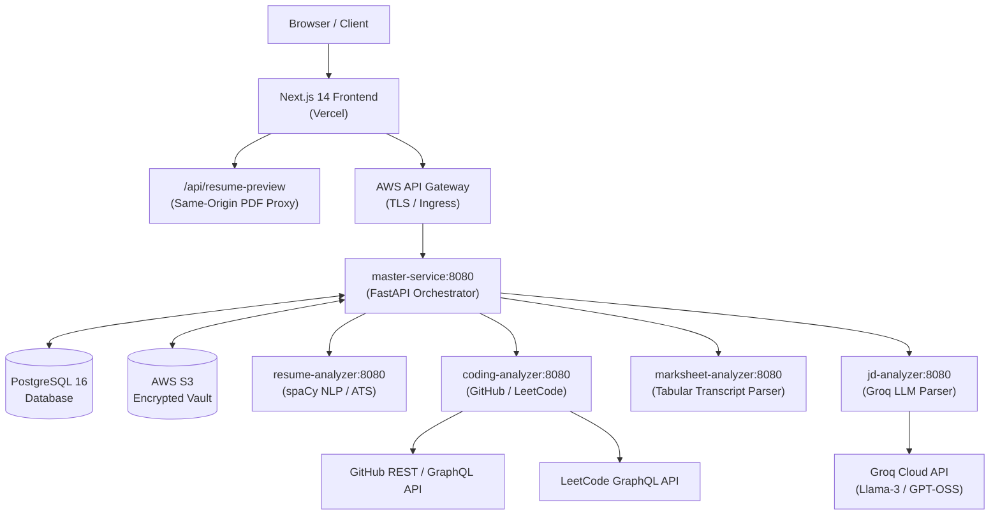
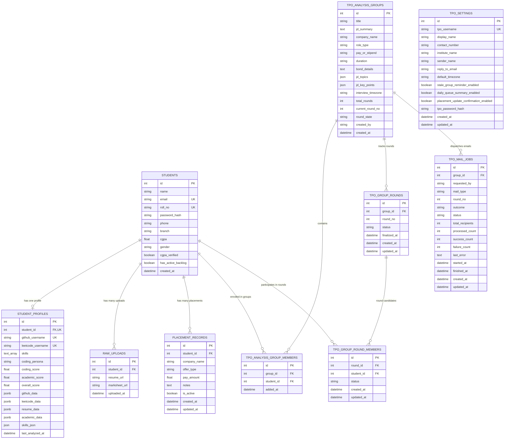
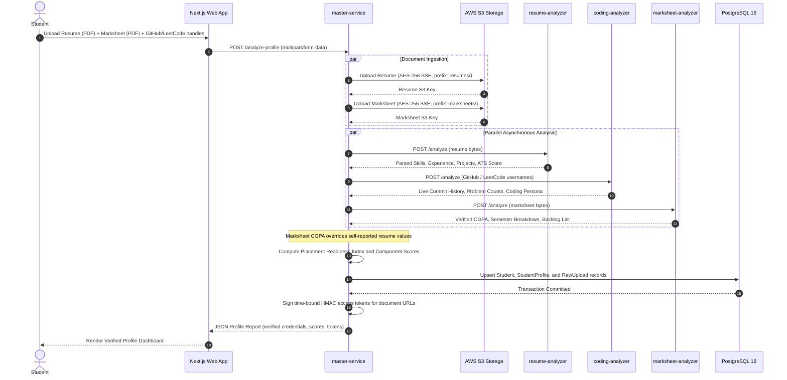
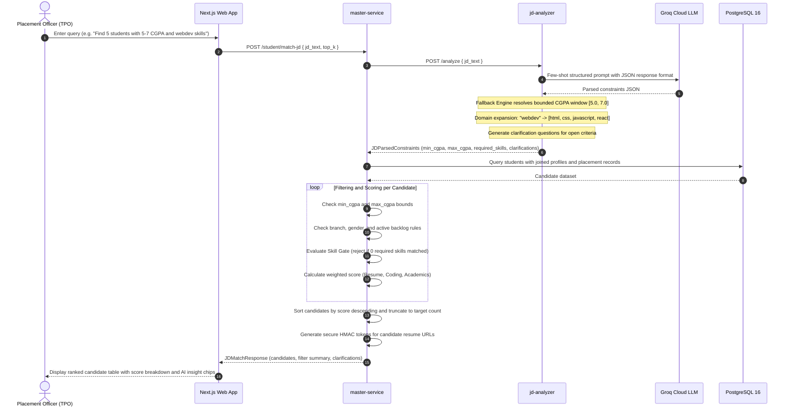

# VerifAI
> Automated Ground-Truth Placement Intelligence and Multi-Dimensional Candidate Verification Platform

[](https://web-six-pi-61.vercel.app/)
[](https://upur1tv9bg.execute-api.us-east-1.amazonaws.com)
[](https://nextjs.org/)
[](https://fastapi.tiangolo.com/)
[](https://www.postgresql.org/)
[](https://groq.com/)
[](https://www.docker.com/)

---

## 1. System Overview

VerifAI is an enterprise placement intelligence platform built for universities, Training and Placement Officers (TPOs), and technical recruiters. It replaces self-reported student resumes with cryptographically validated, multi-source profiles audited against official academic transcripts, live developer registries, and natural language job criteria.

### Problem Addressed
- **Resume Exaggeration and Fraud**: Students routinely inflate self-reported CGPAs, list unverified project competencies, or claim proficiency in technologies they have never used.
- **Manual Backlog and Transcript Auditing**: University placement offices spend hundreds of administrative hours manually cross-checking university marksheets, active arrears, and minimum academic eligibility.
- **Fragile Keyword Shortlisting**: Conventional Applicant Tracking Systems (ATS) rely on exact keyword matches, failing on domain concepts (e.g., matching "webdev" to React and JavaScript) and unable to interpret complex natural language recruiter constraints (e.g., bounded CGPA ranges, branch clusters, or backlog policies).

### Solution Architecture
VerifAI deploys a distributed microservices pipeline:
1. Ingests original transcripts and establishes marksheet computed CGPA as the supreme academic authority.
2. Encrypts documents with AES-256 Server-Side Encryption in private AWS S3 vaults and distributes time-bound HMAC tokens.
3. Audits live GitHub and LeetCode activity in real time to establish verifiable developer aptitude.
4. Uses Groq LLM inference with structured few-shot schemas and deterministic safety nets to parse conversational recruiter queries.
5. Implements a bounded range filtering engine with zero-match disqualification and proactive AI clarification questions.

---

## 2. Live Infrastructure and Endpoints

- **Web Application (Vercel)**: [https://web-six-pi-61.vercel.app/](https://web-six-pi-61.vercel.app/)
- **AWS API Gateway**: `https://upur1tv9bg.execute-api.us-east-1.amazonaws.com`
- **EC2 Compute**: AWS `t3.large` instance running Dockerized microservice containers (`us-east-1`)
- **Document Storage**: Private AWS S3 Bucket with AES-256 Server-Side Encryption (`aws:kms` / `AES256`)

---

## 3. Microservices Topology

The platform consists of six containerized services communicating over internal Docker networking:



### Service Map and Responsibilities

| Service | Host Port | Technology Stack | Core Responsibilities |
| :--- | :--- | :--- | :--- |
| **`web`** | `28084` / `3000` | Next.js 14, React 18, Tailwind CSS, Framer Motion | Student portfolio portal, TPO candidate shortlist explorer, AI insight chips, same-origin PDF proxy |
| **`master-service`** | `28082` / `8080` | FastAPI, SQLAlchemy 2.0, Pydantic v2, Boto3, HTTPX | Central API gateway, parallel task orchestration, HMAC token generation, candidate scoring and filtering |
| **`jd-analyzer`** | `28085` / `8080` | FastAPI, Groq Python SDK, Pydantic v2 | LLM constraint extraction, CGPA bound resolution, domain keyword expansion, clarification generation |
| **`resume-analyzer`** | `28081` / `8080` | FastAPI, spaCy `en_core_web_sm`, PyMuPDF, pdfplumber | PDF text extraction, entity extraction (skills, tools, education), ATS compatibility scoring |
| **`coding-analyzer`** | `28080` / `8080` | FastAPI, HTTPX, BeautifulSoup4, GraphQL | Real-time GitHub commit history and LeetCode problem breakdown auditing; coding persona detection |
| **`marksheet-analyzer`** | `28083` / `8080` | FastAPI, Tabula-py, pdfplumber | University semester marksheet parsing, SGPA calculation, active backlog detection by course code |
| **`postgres`** | `15432` / `5432` | PostgreSQL 16 Alpine, Alembic | ACID relational store for student records, profiles, placement groups, round progression, and mail jobs |

---

## 4. Entity-Relationship Database Schema

The database is built on PostgreSQL 16 with SQLAlchemy 2.0 and Alembic migrations.



---

## 5. System Workflows and Sequence Diagrams

### Sequence 1: Student Analysis and Multi-Source Ingestion Pipeline



---

### Sequence 2: TPO Conversational Search and Candidate Matching Engine



---

## 6. Scoring and Ranking Formulation

The placement readiness score ($S_{\text{final}} \in [0, 100]$) is computed through dynamic weighted evaluation:

$$S_{\text{final}} = w_r \cdot S_{\text{resume}} + w_g \cdot S_{\text{github}} + w_l \cdot S_{\text{leetcode}} + w_a \cdot S_{\text{academics}}$$

### Component Weights

| Component | Weight | Evaluation Method |
| :--- | :--- | :--- |
| **Resume Score ($S_{\text{resume}}$)** | $0.40$ | Direct token matching and skill family intersection against canonical requirements. |
| **GitHub Score ($S_{\text{github}}$)** | $0.20$ | Audit of commit frequency (last 30 days), repository originality, and language spread. |
| **LeetCode Score ($S_{\text{leetcode}}$)** | $0.20$ | Weighted problem difficulty distribution: $\text{Score} \propto 1 \cdot \text{Easy} + 3 \cdot \text{Medium} + 5 \cdot \text{Hard}$. |
| **Academic Score ($S_{\text{academics}}$)** | $0.20$ | Normalized marksheet computed CGPA: $S_{\text{academics}} = \min(100, \frac{\text{CGPA}}{10} \cdot 100)$. |

### Placement Readiness Index (PRI) Tiers
- **Needs Focus**: $S_{\text{final}} < 40.0$
- **Building**: $40.0 \le S_{\text{final}} < 70.0$
- **Ready**: $70.0 \le S_{\text{final}} < 85.0$
- **Exceptional**: $S_{\text{final}} \ge 85.0$

---

## 7. Local Deployment and Development Setup

### System Prerequisites
- Docker Engine 24.0+ and Docker Compose v2.20+
- Node.js 20 LTS and npm 10+
- Python 3.11+

### Environment Configuration
Create a `.env` configuration file in the project root:

```ini
# PostgreSQL Relational Database
POSTGRES_DB=verifai
POSTGRES_USER=postgres
POSTGRES_PASSWORD=your_secure_password

# Authentication & Security
AUTH_JWT_SECRET=your_jwt_secret_key_minimum_32_characters
STORAGE_SIGNING_SECRET=your_hmac_storage_signing_secret

# AWS Cloud Credentials (EC2 IAM Instance Role preferred in production)
AWS_DEFAULT_REGION=us-east-1
S3_BUCKET_NAME=your-private-s3-bucket-name

# Groq Cloud API
GROQ_API_KEY=gsk_your_groq_api_key_here
GROQ_MODEL=openai/gpt-oss-120b

# Frontend Public API URL
NEXT_PUBLIC_API_BASE_URL=http://localhost:28082
```

### Execution via Docker Compose

```bash
# Start all seven services in development mode
docker compose -f docker-compose.dev.yml up --build -d

# Verify container health status
docker compose -f docker-compose.dev.yml ps
```

Local service ports:
- **Next.js Web Portal**: `http://localhost:3000`
- **Master Orchestrator API**: `http://localhost:28082` (Swagger Docs: `/docs`)
- **Resume Analyzer**: `http://localhost:18081`
- **Coding Analyzer**: `http://localhost:18080`
- **Marksheet Analyzer**: `http://localhost:18083`
- **JD Analyzer**: `http://localhost:18085`
- **PostgreSQL Database**: `localhost:15432`

---

## 8. Test Execution and Quality Verification

Automated test suites guarantee zero regression across internal logic and external interfaces:

```bash
# 1. Run Master Service test suite (50 tests: auth, S3 encryption, HMAC tokens, matching)
PYTHONPATH=master-service master-service/.venv/bin/python -m unittest discover master-service/tests/ -v

# 2. Run JD Analyzer test suite (4 tests: range extraction, domain expansion, fallbacks)
PYTHONPATH=jd-analyzer master-service/.venv/bin/python -m unittest discover jd-analyzer/tests/ -v

# 3. Run Frontend Typecheck and Next.js Production Build
cd web && npm run build
```

---

## 9. Repository Structure

```
BHARAT-BUILDS-VerifAI/
|-- .github/workflows/          # Continuous Integration and container publishing
|   |-- docker-build.yml        # Build, smoke test, migration validation
|   `-- publish-images.yml      # Publish images to GitHub Container Registry
|-- docs/                       # Technical specifications and design documents
|-- master-service/             # FastAPI Orchestration Service
|   |-- alembic/                # Database schema migrations
|   |-- app/
|   |   |-- api/                # Endpoints: auth, student, storage, TPO, matching
|   |   |-- database/           # SQLAlchemy declarative models and session factory
|   |   |-- schemas/            # Pydantic request/response schemas
|   |   `-- services/           # Orchestrator, matching, profile, storage services
|   |-- core_engine/            # Scoring math, skill taxonomy, and candidate ranking
|   `-- tests/                  # Integration and unit test cases
|-- jd-analyzer/                # Groq LLM Job Description Parser
|   |-- app/                    # Prompt engineering, schemas, and regex fallbacks
|   `-- tests/                  # Extraction and fallback unit tests
|-- resume-analyzer/            # NLP text extraction, skill entity recognition, ATS scoring
|-- coding-analyzer/            # Real-time GitHub and LeetCode auditing service
|-- marksheet-analyzer/         # University marksheet and semester backlog extraction
|-- web/                        # Next.js 14 Web Frontend
|   |-- app/                    # App Router pages (student dashboard, TPO candidates)
|   |-- components/             # Reusable UI component library (Tailwind, Radix)
|   `-- lib/                    # API client, session management, TypeScript interfaces
|-- docker-compose.dev.yml      # Local development container orchestration
|-- docker-compose.prod.yml     # Production container orchestration
`-- README.md                   # System documentation
```

---

## 10. License and Acknowledgements

Developed for the **Bharat Builds Hackathon**. Built with Next.js, FastAPI, PostgreSQL, and Groq Cloud. Hosted on Vercel and Amazon Web Services.
