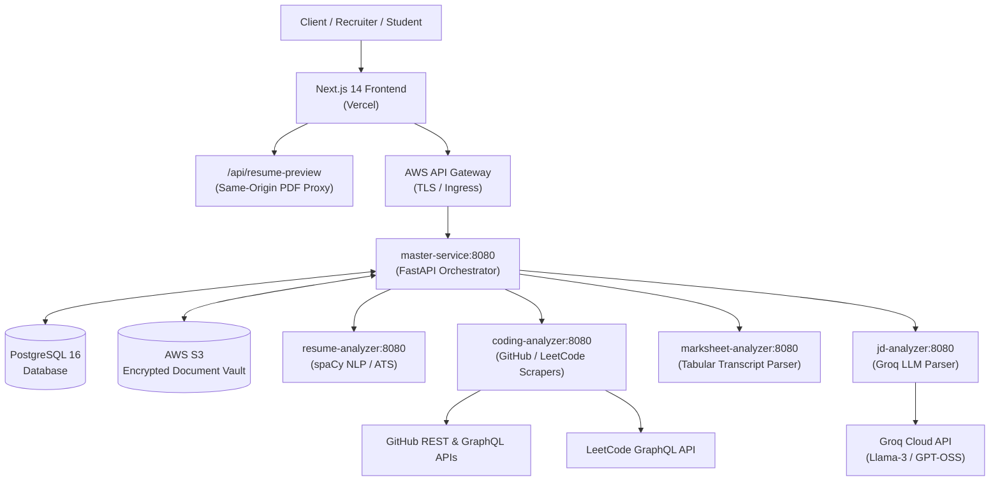
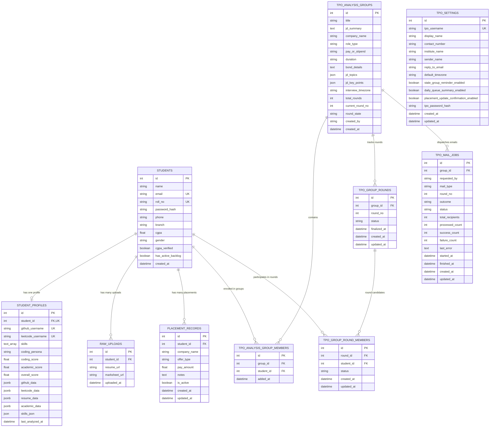
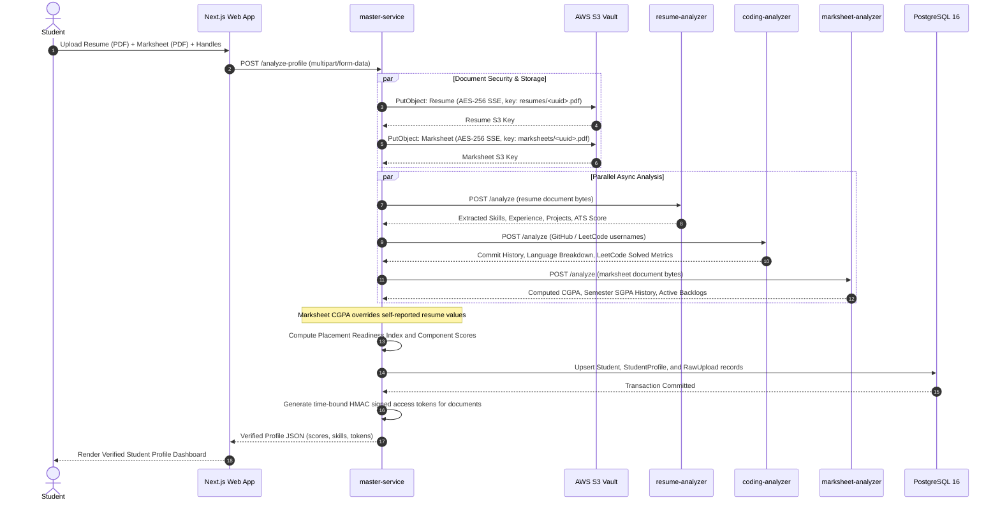
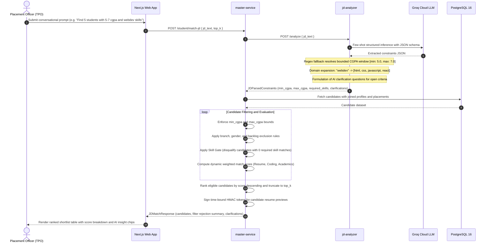

# VerifAI Architecture and Technical Specifications

This document outlines the detailed system architecture, service communication topology, entity-relationship database structure, sequence workflows, and scoring algorithms for VerifAI.

For the database definition in DBML format, see [verifai-schema.dbml](../verifai-schema.dbml).

---

## 1. System Topology and Service Map

VerifAI is designed as an event-driven and REST-oriented microservices platform running across AWS Cloud (EC2, S3, API Gateway) and Vercel.

### Microservice Matrix

| Service | Internal Port | Host Port | Technology Stack | Primary Purpose |
| :--- | :--- | :--- | :--- | :--- |
| `web` | `3000` | `28084` | Next.js 14, React 18, Tailwind CSS, Framer Motion | Student portfolio, TPO candidate shortlist explorer, AI insight chips, PDF proxy |
| `master-service` | `8080` | `28082` | FastAPI, SQLAlchemy 2.0, Pydantic v2, Boto3, HTTPX | Central orchestrator, parallel dispatch, scoring math, HMAC token security |
| `jd-analyzer` | `8080` | `28085` | FastAPI, Groq Python SDK, Pydantic v2 | Conversational query parsing, CGPA bound extraction, skill domain expansion |
| `resume-analyzer` | `8080` | `28081` | FastAPI, spaCy `en_core_web_sm`, PyMuPDF, pdfplumber | Resume text extraction, skill entity recognition, ATS compatibility scoring |
| `coding-analyzer` | `8080` | `28080` | FastAPI, HTTPX, BeautifulSoup4, GraphQL | Live GitHub commit velocity and LeetCode problem breakdown auditing |
| `marksheet-analyzer` | `8080` | `28083` | FastAPI, Tabula-py, pdfplumber | University transcript extraction, SGPA calculation, active backlog detection |
| `postgres` | `5432` | `15432` | PostgreSQL 16 Alpine, Alembic | Relational database for profiles, placement groups, uploads, and round states |

---

## 2. Database Schema and Entity Relationships

The relational model is managed via PostgreSQL 16 and Alembic migrations. Full DBML specification is available in [verifai-schema.dbml](../verifai-schema.dbml).

---

## 3. Detailed Sequence Diagrams

### Sequence Diagram 1: Student Ingestion and Multi-Source Audit

---

### Sequence Diagram 2: Conversational TPO Search and Matching Engine

---

## 4. Scoring Algorithm Formulation

The final candidate rank score ($S_{\text{final}} \in [0, 100]$) is computed through dynamic weighted aggregation:

$$S_{\text{final}} = w_r \cdot S_{\text{resume}} + w_g \cdot S_{\text{github}} + w_l \cdot S_{\text{leetcode}} + w_a \cdot S_{\text{academics}}$$

### Default Weight Distribution

| Component | Default Weight | Scoring Basis |
| :--- | :--- | :--- |
| **Resume Score ($S_{\text{resume}}$)** | $0.40$ | Direct token matching and skill family intersection against required/preferred JD skills. |
| **GitHub Score ($S_{\text{github}}$)** | $0.20$ | 30-day commit velocity, language diversity, and original repository contribution depth. |
| **LeetCode Score ($S_{\text{leetcode}}$)** | $0.20$ | Problem difficulty mix: $\text{Score} \propto 1 \cdot \text{Easy} + 3 \cdot \text{Medium} + 5 \cdot \text{Hard}$. |
| **Academic Score ($S_{\text{academics}}$)** | $0.20$ | Normalized marksheet verified CGPA: $S_{\text{academics}} = \min(100, \frac{\text{CGPA}}{10} \cdot 100)$. |

### Placement Readiness Index (PRI) Tiers
- **Needs Focus**: $S_{\text{final}} < 40.0$
- **Building**: $40.0 \le S_{\text{final}} < 70.0$
- **Ready**: $70.0 \le S_{\text{final}} < 85.0$
- **Exceptional**: $S_{\text{final}} \ge 85.0$

---

## 5. Security and Document Access Architecture

1. **Private S3 Storage**: Objects are stored with Server-Side Encryption (`aws:kms` or `AES256`). Public read access is blocked.
2. **HMAC Signed URLs**: Access to stored documents (`resumes/`, `marksheets/`) requires a cryptographic HMAC signature:
   - Tokens embed the document key, expiration timestamp, and SHA-256 HMAC digest generated with `STORAGE_SIGNING_SECRET`.
   - Path traversal attempts (`..`, backslashes) and unauthorized S3 key prefixes are strictly rejected.
3. **Same-Origin PDF Proxy**: Vercel serves a streaming proxy route `/api/resume-preview` that validates the HMAC token and streams PDF bytes directly to the browser, resolving cross-origin CORS limitations with PDF.js viewers.
